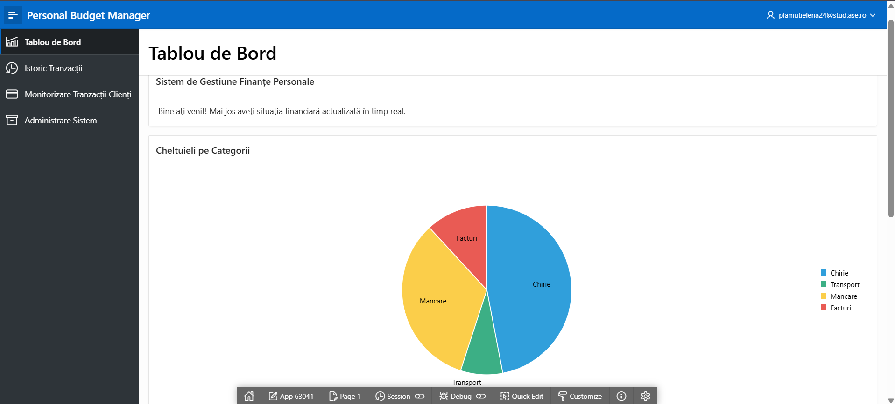
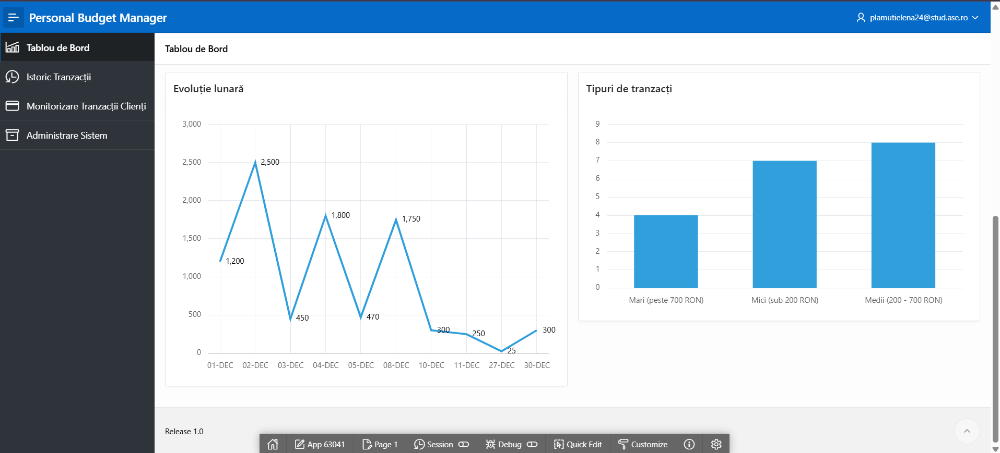
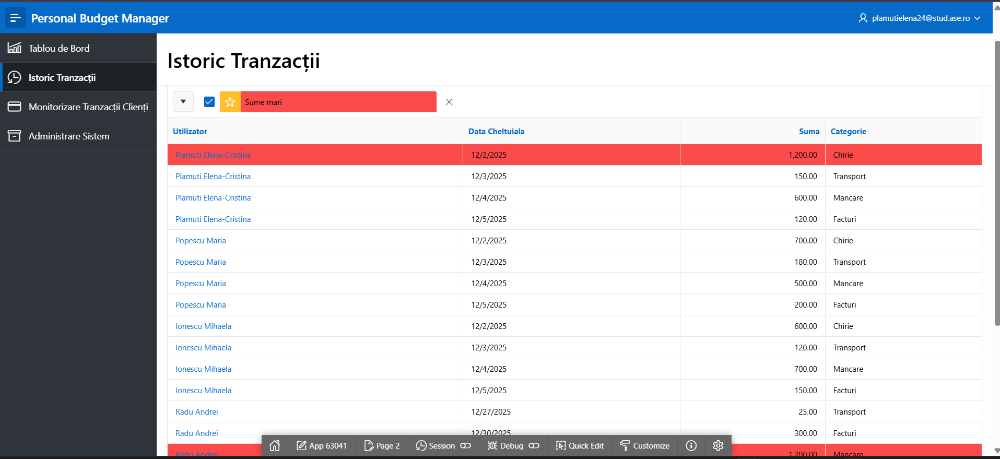
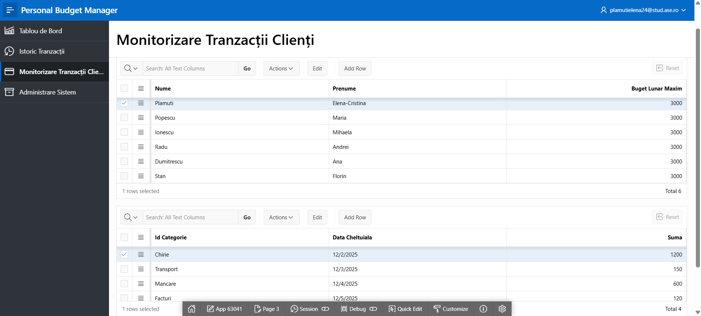
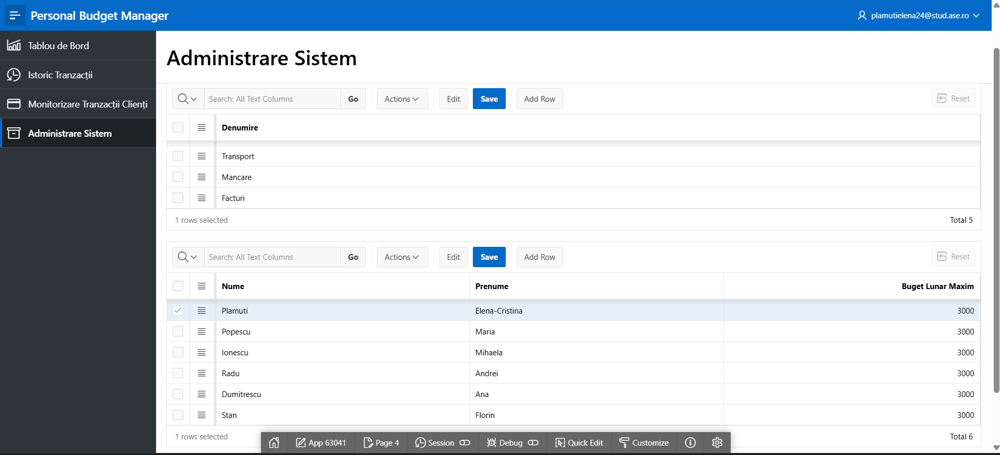
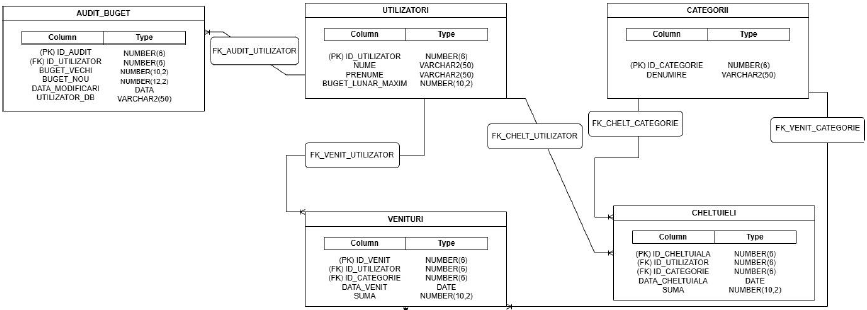

# Personal Budget Management System (Oracle SQL & APEX) 💰

A personal finance management system built with Oracle SQL, PL/SQL, and Oracle APEX. It tracks income and expenses across users, combining backend database logic with an APEX web user interface.

> **Note:** Source code and database identifiers (table names, columns) are written in **Romanian** as part of academic project requirements. A translation key is provided below.

---

## 🚀 How to Run the Project

To set up the project properly, execute the files in order:

1. **`01_create_tables.sql`** – Builds the relational table structures.
2. **`02_constraints_sequences.sql`** – Applies primary keys, foreign keys, constraints, and database triggers.
3. **`03_insert_data.sql`** – Populates the database with sample data.
4. **`04_apex_app.sql`** – Import this file into your Oracle APEX workspace via **App Builder > Import**.

---

## ✨ Key Features
* **Relational Database:** Built on 4 main tables: Users, Categories, Income, and Expenses.
* **Data Integrity & Automation:** Enforced using PKs, FKs, sequences, CHECK constraints, and PL/SQL triggers.
* **PL/SQL Business Logic:** Stored procedures, functions, and packages to handle financial computations and validations.
* **Interactive UI:** Built with Oracle APEX to easily navigate forms, reports, and dashboards.
* **Complex Reporting:** Advanced SQL queries and views to generate financial insights and monthly balances.

---

## 📱 Application Screenshots

| Dashboard Overview | Analytics & Trends |
| :---: | :---: |
|  |  |

| Transaction History | Client Monitoring |
| :---: | :---: |
|  |  |

### System Administration

---

## 📂 Technical Dictionary (Romanian to English)
To help navigate the code, here are the mappings for the main entities:

| Romanian (Code) | English (Meaning) |
| :--- | :--- |
| **`utilizatori`** | Users |
| **`categorii`** | Categories |
| **`venituri`** | Income |
| **`cheltuieli`** | Expenses |
| **`suma`** | Amount |
| **`data`** | Date |

---

## 🛠 Technical Skills Used
* **Database Design & DDL/DML:** Table creation, constraints, sequences, and data manipulation.
* **PL/SQL Programming:** Stored procedures, functions, packages, database triggers, cursors, and exception handling.
* **Advanced SQL:** Joins, aggregate functions, set operators, views, and indexes.
* **Oracle APEX:** App import/deployment, user interface setup, PL/SQL dynamic actions, and form/report integration.

---

## 📊 Database Schema

